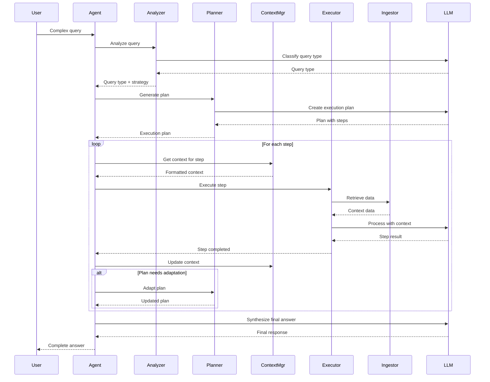

# Политика обработки сложных запросов пользователей

## Обзор

Документ описывает стратегию обработки сложных многошаговых запросов, требующих:
- Многократного обращения к Ingestor
- Управления планом решения задачи
- Динамического формирования контекстов перед каждым обращением к LLM

## Типы сложных запросов

### 1. Аналитические запросы
**Пример:** "Проанализируй архитектуру проекта и предложи улучшения"

**Характеристики:**
- Требуют обзора всего проекта
- Множественные обращения к разным модулям
- Синтез информации из разных источников

**Стратегия:**
1. Получить project overview
2. Для каждого модуля получить детальный контекст
3. Синтезировать общую картину
4. Сформировать рекомендации

### 2. Задачи рефакторинга
**Пример:** "Найди все места использования функции X и предложи как её улучшить"

**Характеристики:**
- Поиск по кодовой базе
- Анализ зависимостей
- Множественные итерации

**Стратегия:**
1. Поиск определения функции
2. Поиск всех использований
3. Анализ контекста каждого использования
4. Формирование плана рефакторинга

### 3. Отладка и диагностика
**Пример:** "Почему тест X падает? Найди причину"

**Характеристики:**
- Итеративный поиск
- Анализ стека вызовов
- Проверка гипотез

**Стратегия:**
1. Получить контекст теста
2. Получить контекст тестируемого кода
3. Анализ зависимостей
4. Формирование и проверка гипотез

## Архитектура решения

### Компоненты

```
┌─────────────────────────────────────────────┐
│         Complex Query Handler               │
├─────────────────────────────────────────────┤
│                                             │
│  ┌──────────────────────────────────────┐   │
│  │  Query Analyzer                      │   │
│  │  - Классификация запроса             │   │
│  │  - Определение стратегии             │   │
│  └──────────────────────────────────────┘   │
│                                             │
│  ┌──────────────────────────────────────┐   │
│  │  Plan Generator                      │   │
│  │  - Разбивка на подзадачи             │   │
│  │  - Определение порядка выполнения    │   │
│  └──────────────────────────────────────┘   │
│                                             │
│  ┌──────────────────────────────────────┐   │
│  │  Context Manager                     │   │
│  │  - Управление контекстом между шагами│   │
│  │  - Кэширование промежуточных данных  │   │
│  └──────────────────────────────────────┘   │
│                                             │
│  ┌──────────────────────────────────────┐   │
│  │  Execution Engine                    │   │
│  │  - Выполнение плана                  │   │
│  │  - Адаптация при необходимости       │   │
│  └──────────────────────────────────────┘   │
│                                             │
└─────────────────────────────────────────────┘
```

### 1. Query Analyzer

**Задача:** Определить тип запроса и выбрать стратегию.

**Классификация:**
- Simple (одно обращение к Ingestor)
- Analytical (обзор + детали)
- Iterative (поиск + анализ + уточнение)
- Diagnostic (гипотезы + проверка)

**Реализация:**
```python
class QueryAnalyzer:
    async def analyze(self, query: str) -> QueryType:
        # Используем LLM для классификации
        prompt = f"""
        Classify the following query:
        {query}
        
        Types:
        - simple: Single lookup or question
        - analytical: Requires overview and synthesis
        - iterative: Requires search and refinement
        - diagnostic: Requires hypothesis testing
        """
        
        response = await llm.ainvoke(prompt)
        return QueryType.from_string(response)
```

### 2. Plan Generator

**Задача:** Создать план выполнения запроса.

**План включает:**
- Список шагов (steps)
- Зависимости между шагами
- Требуемый контекст для каждого шага
- Критерии успеха

**Пример плана:**
```python
plan = Plan(
    steps=[
        Step(
            id="1",
            action="get_overview",
            params={},
            context_requirements=["project_structure"],
        ),
        Step(
            id="2",
            action="search_modules",
            params={"query": "authentication"},
            context_requirements=["overview_from_step_1"],
            depends_on=["1"],
        ),
        Step(
            id="3",
            action="analyze_and_synthesize",
            params={},
            context_requirements=["all_previous"],
            depends_on=["1", "2"],
        ),
    ]
)
```

### 3. Context Manager

**Задача:** Управление контекстом между шагами.

**Функции:**
- Кэширование результатов шагов
- Формирование контекста для следующего шага
- Управление размером контекста (token budget)

**Стратегии управления контекстом:**

#### a) Sliding Window
Сохраняем только последние N шагов:
```python
context = {
    "current_step": step_3,
    "previous_steps": [step_2, step_1],  # Последние 2
    "summary": "Overall progress summary",
}
```

#### b) Hierarchical Summarization
Старые шаги заменяются резюме:
```python
context = {
    "current_step": step_5,
    "recent_steps": [step_4, step_3],  # Полный контекст
    "older_steps_summary": "Steps 1-2: Found auth module...",
}
```

#### c) Selective Context
Включаем только релевантные части:
```python
context = {
    "current_step": step_3,
    "relevant_from_step_1": "Project has 5 modules",
    "relevant_from_step_2": "Auth module uses JWT",
}
```

### 4. Execution Engine

**Задача:** Выполнить план с адаптацией.

**Процесс:**
1. Выполнить шаг
2. Оценить результат
3. Обновить контекст
4. Адаптировать план если нужно
5. Перейти к следующему шагу

**Адаптация плана:**
- Добавление новых шагов при обнаружении проблем
- Пропуск шагов если цель достигнута раньше
- Изменение параметров на основе промежуточных результатов

## Workflow для сложных запросов



## Управление токенами в многошаговых запросах

### Проблема
При многошаговом выполнении контекст растет:
- История шагов
- Промежуточные результаты
- RAG контекст для каждого шага

### Решение: Динамический бюджет

```python
class TokenBudgetManager:
    def __init__(self, total_budget: int):
        self.total_budget = total_budget
        self.reserved_for_response = 512  # Резерв для ответа
        
    def allocate_for_step(
        self,
        step_number: int,
        total_steps: int,
        context_size: int,
    ) -> Dict[str, int]:
        """
        Распределяет бюджет для шага.
        
        Returns:
            {
                "history": tokens for previous steps,
                "rag": tokens for RAG context,
                "response": tokens for LLM response,
            }
        """
        available = self.total_budget - self.reserved_for_response - context_size
        
        # Ранние шаги - больше на RAG
        # Поздние шаги - больше на историю
        progress = step_number / total_steps
        
        rag_ratio = 1.0 - progress * 0.5  # От 100% до 50%
        history_ratio = progress * 0.5    # От 0% до 50%
        
        return {
            "history": int(available * history_ratio),
            "rag": int(available * rag_ratio),
            "response": self.reserved_for_response,
        }
```

## Примеры реализации

### Пример 1: Аналитический запрос

**Запрос:** "Проанализируй архитектуру проекта"

**План:**
```python
steps = [
    {
        "id": "overview",
        "action": "get_project_overview",
        "rag_query": None,  # Используем overview endpoint
    },
    {
        "id": "analyze_modules",
        "action": "analyze_each_module",
        "rag_query": "module architecture patterns",
        "depends_on": ["overview"],
    },
    {
        "id": "synthesize",
        "action": "synthesize_findings",
        "rag_query": None,
        "depends_on": ["overview", "analyze_modules"],
    },
]
```

**Контекст для шага 2:**
```python
context = {
    "overview": {
        "modules": ["auth", "api", "storage"],
        "total_files": 150,
    },
    "current_module": "auth",
    "rag_context": "# Auth module patterns...",
}
```

### Пример 2: Итеративный поиск

**Запрос:** "Найди все использования функции authenticate()"

**План:**
```python
steps = [
    {
        "id": "find_definition",
        "action": "search",
        "rag_query": "function authenticate definition",
    },
    {
        "id": "find_usages",
        "action": "search",
        "rag_query": "authenticate function calls",
        "depends_on": ["find_definition"],
    },
    {
        "id": "analyze_contexts",
        "action": "get_file_contexts",
        "files": ["from_step_2"],
        "depends_on": ["find_usages"],
    },
    {
        "id": "summarize",
        "action": "summarize_findings",
        "depends_on": ["find_definition", "find_usages", "analyze_contexts"],
    },
]
```

## Метрики и мониторинг

### Ключевые метрики

1. **Plan Efficiency**
   - Количество шагов в плане
   - Количество выполненных шагов
   - Количество адаптаций плана

2. **Token Usage**
   - Токены на шаг
   - Общее использование токенов
   - Эффективность использования RAG контекста

3. **Execution Time**
   - Время на шаг
   - Общее время выполнения
   - Время ожидания Ingestor

4. **Quality Metrics**
   - Релевантность RAG контекста
   - Успешность выполнения плана
   - Удовлетворенность пользователя (если есть feedback)

### Логирование

```python
logger.info(
    "complex_query.step_completed",
    step_id=step.id,
    step_number=current_step,
    total_steps=len(plan.steps),
    tokens_used=tokens,
    rag_items_retrieved=len(rag_items),
    execution_time_ms=elapsed_ms,
)
```

## Ограничения и риски

### Ограничения

1. **Token Budget**
   - Максимум 4K токенов на весь запрос
   - Необходимость агрессивной суммаризации

2. **Latency**
   - Каждый шаг = обращение к Ingestor + LLM
   - Может занять 10-30 секунд для сложных запросов

3. **Complexity**
   - Сложные планы могут быть неоптимальными
   - Риск зацикливания при адаптации

### Риски и митигация

| Риск | Вероятность | Влияние | Митигация |
|------|-------------|---------|-----------|
| Переполнение контекста | Высокая | Критическое | Динамический бюджет + суммаризация |
| Неоптимальный план | Средняя | Среднее | Валидация плана перед выполнением |
| Зацикливание | Низкая | Высокое | Максимум итераций + детекция циклов |
| Ingestor недоступен | Средняя | Высокое | Graceful degradation + кэширование |

## Roadmap

### Phase 1: MVP (Текущая реализация)
- ✅ Простые запросы с одним обращением к Ingestor
- ✅ Базовое управление контекстом
- ✅ Token budget management

### Phase 2: Basic Planning (Следующий шаг)
- [ ] Query Analyzer для классификации
- [ ] Simple Plan Generator (фиксированные шаблоны)
- [ ] Context Manager с кэшированием
- [ ] Execution Engine для последовательного выполнения

### Phase 3: Advanced Planning
- [ ] LLM-based Plan Generation
- [ ] Dynamic plan adaptation
- [ ] Parallel step execution
- [ ] Advanced context strategies

### Phase 4: Optimization
- [ ] Plan optimization
- [ ] Context caching
- [ ] Predictive prefetching
- [ ] Quality metrics and feedback loop

## Заключение

Обработка сложных запросов требует:
1. **Планирования** - разбивка на шаги
2. **Управления контекстом** - эффективное использование токенов
3. **Адаптации** - корректировка плана на основе результатов
4. **Мониторинга** - отслеживание эффективности

Предложенная архитектура обеспечивает фундамент для реализации этих возможностей с постепенным усложнением от простых шаблонов к полностью динамическому планированию.
