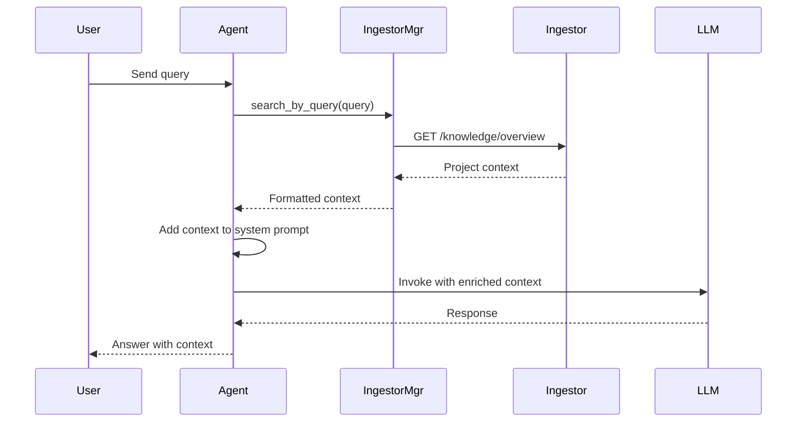

# Интеграция Ingestor с LangGraph Agent

## Обзор

Интеграция позволяет агенту использовать индексированные знания из Ingestor для формирования контекста при ответах на
запросы пользователя.

## Архитектура

```
┌─────────────┐
│   User      │
└──────┬──────┘
       │
       ▼
┌─────────────────────────────────────┐
│      LangGraph Agent                │
│  ┌──────────────────────────────┐   │
│  │  ChatHandler                 │   │
│  └────────┬─────────────────────┘   │
│           │                         │
│           ▼                         │
│  ┌──────────────────────────────┐   │
│  │  Agent Node                  │   │
│  │  - Retrieve RAG Context      │   │
│  │  - Add to System Prompt      │   │
│  │  - Call LLM                  │   │
│  └────────┬─────────────────────┘   │
│           │                         │
└───────────┼─────────────────────────┘
            │
            ▼
   ┌────────────────┐
   │  IngestorManager│
   └────────┬────────┘
            │
            ▼
   ┌────────────────┐
   │   Ingestor     │
   │  (Port 8124)   │
   └────────────────┘
```

## Компоненты

### 1. IngestorManager (`agents/app/managers/ingestor.py`)

Менеджер для взаимодействия с Ingestor через HTTP API.

**Основные методы:**

- `search_by_query(query, top_k)` - поиск релевантного контекста
- `get_file_context(file_path)` - получение контекста файла
- `get_project_overview()` - получение обзора проекта
- `set_llm_lock(locked, ttl)` - управление блокировкой LLM
- `format_context_for_llm(context_items)` - форматирование контекста для LLM

**Особенности:**

- Асинхронное взаимодействие через httpx
- Автоматическое переподключение
- Graceful degradation (работает без Ingestor)

### 2. RAG Context Retrieval (`agents/app/nodes/agent.py`)

Функция `retrieve_rag_context()` извлекает релевантный контекст из Ingestor.

**Процесс:**

1. Извлекает последний запрос пользователя
2. Отправляет запрос в Ingestor
3. Получает топ-K релевантных чанков
4. Форматирует контекст для LLM

### 3. Agent Node Integration

Узел агента обновлен для интеграции RAG контекста:

1. **Извлечение запроса** - получает последнее сообщение пользователя
2. **Получение контекста** - вызывает `retrieve_rag_context()`
3. **Формирование промпта** - добавляет контекст к system prompt
4. **Контроль токенов** - проверяет лимиты контекста
5. **Вызов LLM** - отправляет обогащенный промпт

### 4. SystemManager Updates

SystemManager теперь управляет IngestorManager:

```python
self.ingestor = IngestorManager()
await self.ingestor.initialize()
```

## Конфигурация

### Environment Variables

```bash
INGESTOR_URL=http://ingestor:8124
```

### Docker Compose

```yaml
langgraph-agent:
  environment:
    - INGESTOR_URL=http://ingestor:8124
  depends_on:
    - llm
    - ingestor
```

## API Endpoints (Ingestor)

### Knowledge Port

- `POST /knowledge/search` - поиск по embedding
  ```json
  {
    "query_embedding": [0.1, 0.2, ...],
    "top_k": 5
  }
  ```

- `GET /knowledge/file/{path}` - контекст файла
- `GET /knowledge/overview` - обзор проекта

### LLM Lock

- `POST /system/llm_lock` - установить блокировку
  ```json
  {
    "locked": true,
    "ttl_seconds": 300
  }
  ```

- `GET /system/llm_lock` - состояние блокировки

## Workflow



## Пример использования

### Запрос пользователя

```
"Как работает pipeline в ingestor?"
```

### RAG Context (добавляется к system prompt)

```markdown
# Project Knowledge Context

## Module: ingestor/app/pipeline

Files: 5
Summary: Pipeline для обработки кода: Scan → Parse → Enrich → Embed → Persist

## Module: ingestor/app

Files: 8
Summary: Основные компоненты Ingestor: API, storage, lifecycle management
```

### Результат

LLM получает контекст о структуре проекта и может дать более точный ответ.

## Управление контекстом

### Token Budget

```python
# Проверка лимитов
tokens = estimate_messages_tokens(messages)
rag_tokens = estimate_tokens(rag_context)

if tokens + rag_tokens > MAX_TOKENS - SAFETY_MARGIN:
    # Пропускаем RAG контекст при переполнении
    system_content = Config.SYSTEM_PROMPT
```

### Graceful Degradation

Если Ingestor недоступен:

- Агент продолжает работать без RAG контекста
- Логируется предупреждение
- Используется базовый system prompt

## Мониторинг

### Логи

```python
logger.info(f"Retrieved RAG context: {len(context_text)} chars")
logger.info(f"Context tokens: messages={tokens}, rag={rag_tokens}")
```

### Health Check

```bash
curl http://localhost:8123/health
```

Ответ включает статус Ingestor:

```json
{
  "ingestor_ready": true,
  "ingestor_status": {
    "connected": true,
    "connections": {
      "ingestor-server": true
    }
  }
}
```

## Будущие улучшения

1. **Embedding-based Search** - использовать embedding для более точного поиска
2. **Context Caching** - кэширование часто используемого контекста
3. **Smart Context Selection** - выбор релевантных чанков на основе типа запроса
4. **LLM Lock Integration** - автоматическая блокировка LLM при работе агента
5. **Metrics** - метрики использования RAG (hit rate, context quality)

## Troubleshooting

### Ingestor не подключается

```bash
# Проверить доступность
curl http://localhost:8124/health

# Проверить логи
docker-compose logs ingestor
```

### RAG контекст не добавляется

```bash
# Проверить статус в логах агента
docker-compose logs langgraph-agent | grep "RAG context"
```

### Переполнение контекста

Увеличить `MAX_MODEL_TOKENS` или уменьшить `top_k` в поиске.

## Заключение

Интеграция Ingestor с LangGraph Agent обеспечивает:

- ✅ Автоматическое обогащение контекста из индексированной базы знаний
- ✅ Graceful degradation при недоступности Ingestor
- ✅ Контроль токенов и управление контекстом
- ✅ Мониторинг и логирование
- ✅ Расширяемая архитектура для будущих улучшений
