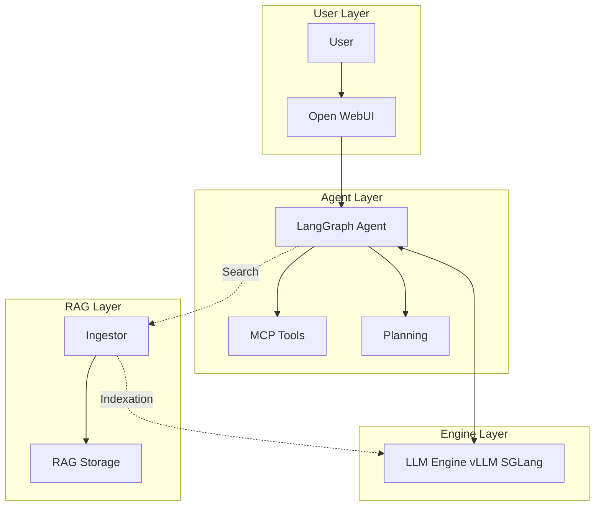
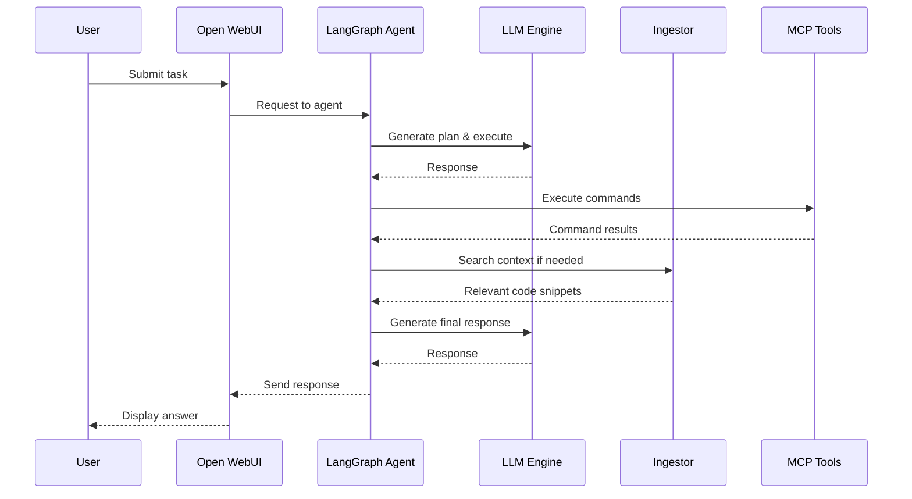

# perslad

**Personal Local Assistant for Developer**

[AI-powered autonomous development system running on local models]


## 📖 Description

An actively developed AI-powered autonomous development system based on local LLMs with multi-agent architecture. A
fully autonomous autopilot for code analysis, code generation, and command execution.

**Key feature:** Runs on local models (Qwen, Llama, DeepSeek) to reduce dependency on cloud AI services, minimizing API
costs and latency.

**Project Status:** Early Stage Development - Actively evolving, features under active development.

## 🚀 Quick Start

### Prerequisites

- Docker
- NVIDIA GPU with CUDA support (recommended: 16 GB+ VRAM)
- Minimum 16 GB system RAM
- Minimum 20 GB free disk space

### Local Setup (with Docker)

```bash
# Copy and configure .env
cp .env.example .env

# Start all components
docker-compose up -d

# Open the web interface
open http://localhost:8080
```

### Component Status

- LLM Engine (vLLM/SGLang): `http://localhost:8000`
- LangGraph Agent: `http://localhost:8123`
- Ingestor: `http://localhost:8124`
- Open WebUI: `http://localhost:8080`

## 🏗️ Architecture

### Components

| Component           | Description                         | Ports            |
|---------------------|-------------------------------------|------------------|
| **LLM Engine**      | vLLM/SGLang with Qwen/Llama models  | 8000             |
| **LangGraph Agent** | Orchestrating agent with MCP tools  | 8123             |
| **MCP Servers**     | Bash, Project, SQL tools            | 8081, 8083, 8082 |
| **Ingestor**        | RAG engine with background indexing | 8124             |
| **Open WebUI**      | Web interface for agent interaction | 8080             |

### Architecture Diagram



### Workflow



## 📦 Components

### 1. LLM Engine

- **Models:** Qwen2.5-7B-Instruct, Meta-Llama-3-8B, DeepSeek-Coder
- **Optimization:** AWQ/GPTQ for GPU
- **API:** OpenAI-compatible

### 2. LangGraph Agent

- Stateful agent architecture with memory
- MCP tools for extended capabilities
- RAG-powered memory (Postgres)
- Autonomous planning and execution

### 3. Ingestor

- Code and documentation indexing
- Pipeline: Scan → Parse → Enrich → Embed → Persist
- LLM lock for coordination with agent
- Knowledge Port API for search

### 4. MCP Servers

- **bash:** Shell command execution
- **project:** Project navigation
- **sql:** PostgreSQL operations

## 🔧 Configuration

### Main Variables (.env)

```bash
# Model
MODEL_NAME=Qwen/Qwen2.5-7B-Instruct-AWQ
LLM_ENGINE_IMAGE=lmsysorg/sglang

# Project
PROJECT_ROOT=/path/to/your/project

# GPU
GPU_MEM_FRACTION=0.8

# Tools
MCP_BASH_URL=http://mcp-bash:8081/mcp
MCP_PROJECT_URL=http://mcp-project:8083/mcp
```

### Startup Modes

```bash
docker-compose up -d
```

## 📖 API

### Health Check

```bash
curl http://localhost:8123/health
```

### LangGraph Agent

```
POST http://localhost:8123/api/chat/v1/chat/completions
```

### Ingestor Knowledge Port

```
POST http://localhost:8124/v1/knowledge/search
GET  http://localhost:8124/v1/knowledge/file/{path}
GET  http://localhost:8124/v1/knowledge/overview
```

## 🛠 Development

### Development Environment

```bash
# Create virtual environment
python -m venv venv
source venv/bin/activate

# Install dependencies
pip install -r agents/requirements.txt
pip install -r ingestor/requirements.txt
pip install -r servers/requirements.txt

# Import Ingestor for development
cd agents && python -m app.main
cd ingestor && python -m app.main
```

## 📝 How It Works

1. **Initialization:** Model loading (~2-5 min)
2. **Indexing:** Ingestor scans codebase
3. **Chat:** Web interface interacts with agent
4. **Execution:** Agent uses MCP tools
5. **Memory:** Results stored in RAG

## 🔒 Security

- All models run locally on your hardware
- No data leaves your machine (unless you call cloud LLM)
- Local GPU utilization reduces cloud API calls
- Secure Docker volumes for data isolation

## 🌟 Benefits

### Cost Reduction

- Eliminates cloud API costs for routine tasks
- Local inference for immediate responses
- Reduced API call frequency

### Performance

- Faster response times without network latency
- No rate limits from cloud providers
- Full control over model versions

### Privacy

- Complete data isolation
- No external data transmission
- Compliance with data protection requirements

## 🌍 Ecosystem

Connectable components:

- MCP (Model Context Protocol) - tool extensions
- Nebula Graph - graph storage
- pgvector - vector storage

## 📚 Documentation

- [Ingestor README](ingestor/README.md) - detailed component documentation
- [E2E Tests](e2e-tests/README.md) - end-to-end testing framework

## 🧪 Testing

### End-to-End Tests

A comprehensive test suite is available for testing the entire system:

```bash
# Run E2E tests from project root
./run_e2e_tests.sh

# Or directly from e2e-tests directory
cd e2e-tests
./scripts/run_e2e_tests.sh

# Using make
cd e2e-tests
make test          # Run all tests
make test-component # Component tests only
make test-e2e      # E2E tests only
make test-coverage # With coverage report
```

### Test Features

- **Isolated test environment** with Docker Compose
- **Component testing** - individual service validation
- **Integration testing** - component interactions
- **End-to-end workflows** - complete user scenarios
- **Performance benchmarks** - system performance metrics
- **Coverage reporting** - HTML and XML reports

For detailed documentation, see [e2e-tests/README.md](e2e-tests/README.md)

## 🤝 Contributing

1. Fork the repository
2. Create a feature branch
3. Add tests
4. Submit a Pull Request

## 📄 License

MIT License - see LICENSE file for details

## 🙏 Acknowledgments

- vLLM and SGLang for LLM inference engine
- LangChain/LangGraph for framework
- Open WebUI for interface
- Community for ideas and contributions

## 📧 Contact

- [GitHub Issues](https://github.com/svok/perslad/issues)
- [GitHub Discussions](https://github.com/svok/perslad/discussions)

## ⚠️ Limitations

- GPU required for performance
- Significant memory resources needed
- Not intended for large-scale production use without enhancements
- Early development stage - APIs and features may change
